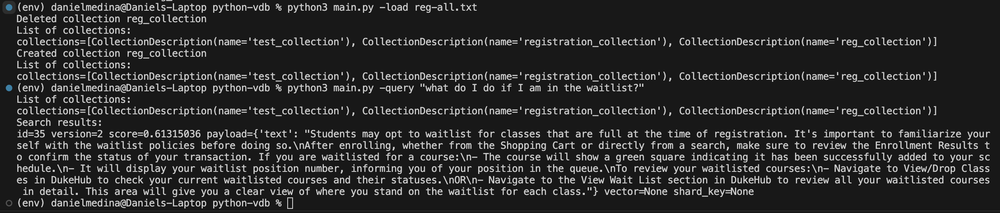

# Duke Registration Process: Qdrant Vector Database

By Daniel Medina

This tool is designed to assist users in querying information about the Duke registration process and policies. It loads chunks of text related to the Duke registration process into a vector database, allowing users to submit queries about the registration process and retrieve the most relevant text chunks based on vector similarity search.

## Functionality

### Data Ingestion

The program accepts a text file containing chunks of text about the Duke registration process. Each chunk of text should be separated by two newline characters ("\n\n"). These text chunks are then embedded using a pre-trained Sentence Transformer model, and the embeddings, along with their corresponding text chunks, are stored in a vector database.

### Querying

Users can submit queries about the registration process using natural language queries. The program embeds the user query using the same pre-trained Sentence Transformer model and performs a vector similarity search against the stored text chunks in the vector database. The most relevant text chunks are retrieved based on the similarity of their embeddings to the embedding of the user query.

### Visualization

The output of the program is displayed in the terminal. When a user submits a query, the program prints the most relevant text chunks along with their corresponding text. This provides users with a clear view of the information related to their query.

As you can see below, the program takes a text file as input and loads the text chunks into the Qdrant vector database. Then the user can ask a question and the program will retrieve the most similar vector and display its corresponding chunk.



## Usage

To use this program, follow these steps:

1. Prepare a text file containing chunks of text about the Duke registration process. Each chunk should be separated by two newline characters ("\n\n").

2. Run the program with the `-load` flag followed by the path to the text file to load the data into the vector database. For example:
   ```bash
   python3 main.py -load reg-all.txt

